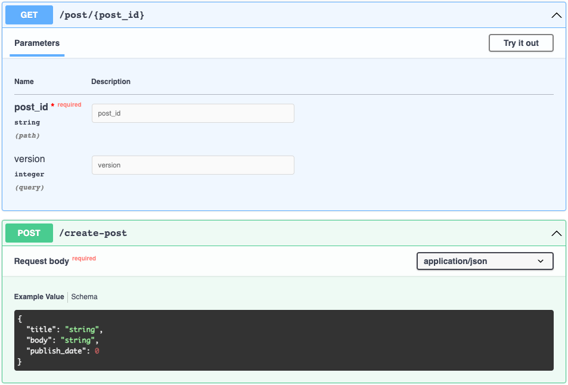

# 🎾 openapi-fetch

Ultra-fast fetching for TypeScript generated automatically from your OpenAPI schema. Weighs in at **1 kb** and has virtually zero runtime. Works with React, Vue, Svelte, or vanilla JS.

| Library                        | Size (min) |
| :----------------------------- | ---------: |
| **openapi-fetch**              |     `1 kB` |
| **openapi-typescript-fetch**   |     `4 kB` |
| **openapi-typescript-codegen** | `345 kB`\* |

\* _Note: the larger your schema, the larger your codegen size. This is the actual weight of GitHub’s REST API._

The syntax is inspired by popular libraries like react-query or Apollo client, but without all the bells and whistles and in a 1 kb package.

```ts
import createClient from 'openapi-fetch';
import { paths } from './v1'; // (generated from openapi-typescript)

const { get, post } = createClient<paths>({ baseUrl: 'https://myapi.dev/v1/' });

// Type-checked request
await post('/create-post', {
  body: {
    title: 'My New Post',
    // ❌ Property 'publish_date' is missing in type …
  },
});

// Type-checked response
const { data, error } = await get('/post/my-blog-post');

console.log(data.title); // ❌ 'data' is possibly 'undefined'
console.log(error.message); // ❌ 'error' is possibly 'undefined'
console.log(data?.foo); // ❌ Property 'foo' does not exist on type …
```

Notice **there are no generics, and no manual typing.** Your endpoint’s exact request & response was inferred automatically off the URL. This makes a **big difference** in the type safety of your endpoints! This eliminates all of the following:

- ✅ No typos in URLs or params
- ✅ All parameters, request bodies, and responses are type-checked and 100% match your schema
- ✅ No manual typing of your API
- ✅ Eliminates `any` types that hide bugs
- ✅ Also eliminates `as` type overrides that can also hide bugs
- ✅ All of this in a **1 kB** client package 🎉

## 🔧 Setup

First, install this package and [openapi-typescript](https://github.com/drwpow/openapi-typescript) from npm:

```
npm i openapi-fetch
npm i -D openapi-typescript
```

Next, generate TypeScript types from your OpenAPI schema using openapi-typescript:

```
npx openapi-typescript ./path/to/api/v1.yaml -o ./src/lib/api/v1.d.ts
```

_Note: be sure to [validate](https://apitools.dev/swagger-cli/) your schema first! openapi-typescript will err on invalid schemas._

Lastly, create the client while configuring default options:

```ts
import createClient from 'openapi-fetch';
import { paths } from './v1'; // (generated from openapi-typescript)

const { get, post, put, patch, del } = createClient<paths>({
  baseUrl: 'https://myserver.com/api/v1/',
  headers: {
    Authorization: `Bearer ${myAuthToken}`,
  },
});
```

## 🏓 Usage

Using **openapi-fetch** is as easy as reading your schema! For example, given the following schema:



Here’s how you’d fetch both endpoints:

```ts
import createClient from 'openapi-fetch';
import { paths } from './v1';

const { get, post } = createClient<paths>({ baseUrl: 'https://myapi.dev/v1/' });

// GET /post/{post_id}
const { data, error } = await get('/post/{post_id}', {
  params: {
    path: { post_id: 'my-post' },
    query: { version: 2 },
  },
});

// POST /create-post
const { data, error } = await post('/create-post', {
  body: {
    title: 'New Post',
    body: '<p>New post body</p>',
    publish_date: new Date('2023-03-01T12:00:00Z').getTime(),
  },
});
```

- The URL **must match the actual schema** (`/post/{post_id}`). This library replaces all **path** params for you (so they can be typechecked).
- The `params` object will contain your `path` and `query` parameters, enforcing the correct types.
- The request `body` will only be required if the endpoint needs it.
- The endpoint will then respond with **data**, **error**, and **response**.
  - **data** will contain your typechecked successful response if the request succeeded (`2xx`); otherwise it will be `undefined`
  - **error** likewise contains your typechecked error response if the request failed (`4xx` / `5xx`); otherwise it will be `undefined`
  - **response** has other information about the request such as `status`, `headers`, etc. It is not typechecked.

### 🔀 Parameter Serialization

In the spirit of being lightweight, this library only uses [URLSearchParams](https://developer.mozilla.org/en-US/docs/Web/API/URLSearchParams) to [serialize parameters](https://swagger.io/docs/specification/serialization/). So for complex query param types (e.g. arrays) you’ll need to provide your own `querySerializer()` method that transforms query params into a URL-safe string:

```ts
import createClient from 'openapi-fetch';
import { paths } from './v1';

const { get, post } = createClient<paths>({ baseUrl: 'https://myapi.dev/v1/' });

const { data, error } = await get('/post/{post_id}', {
  params: {
    path: { post_id: 'my-post' },
    query: { version: 2 },
  },
  querySerializer: (q) => `v=${q.version}`, // ✅ Still typechecked based on the URL!
});
```

### 🔒 Handling Auth

Authentication often requires some reactivity dependent on a token. Since this library is so low-level, there are myriad ways to handle it:

#### Nano Stores

Here’s how it can be handled using [nanostores](https://github.com/nanostores/nanostores), a tiny (334 b), universal signals store:

```ts
// src/lib/api/index.ts
import { atom, computed } from 'nanostores';
import createClient from 'openapi-fetch';
import { paths } from './v1';

export const authToken = atom<string | undefined>();
someAuthMethod().then((newToken) => authToken.set(newToken));

export const client = computed(authToken, (currentToken) =>
  createClient<paths>({
    headers: currentToken ? { Authorization: `Bearer ${currentToken}` } : {},
    baseUrl: 'https://myapi.dev/v1/',
  })
);

// src/some-other-file.ts
import { client } from './lib/api';

const { get, post } = client.get();

get('/some-authenticated-url', {
  /* … */
});
```

#### Vanilla JS Proxies

You can also use [proxies](https://developer.mozilla.org/en-US/docs/Web/JavaScript/Reference/Global_Objects/Proxy) which are now supported in all modern browsers:

```ts
// src/lib/api/index.ts
import createClient from 'openapi-fetch';
import { paths } from './v1';

let authToken: string | undefined = undefined;
someAuthMethod().then((newToken) => (authToken = newToken));

const baseClient = createClient<paths>({ baseUrl: 'https://myapi.dev/v1/' });
export default new Proxy(baseClient, {
  get(_, key: keyof typeof baseClient) {
    const newClient = createClient<paths>({ headers: authToken ? { Authorization: `Bearer ${authToken}` } : {}, baseUrl: 'https://myapi.dev/v1/' });
    return newClient[key];
  },
});

// src/some-other-file.ts
import client from './lib/api';

client.get('/some-authenticated-url', {
  /* … */
});
```

## 🎛️ Config

**createClient** accepts the following options, which set the default settings for all subsequent fetch calls.

```ts
createClient<paths>(options);
```

| Name            |   Type   | Description                                                                                                                              |
| :-------------- | :------: | :--------------------------------------------------------------------------------------------------------------------------------------- |
| `baseUrl`       | `string` | Prefix all fetch URLs with this option (e.g. `"https://myapi.dev/v1/"`).                                                                 |
| (Fetch options) |          | Any valid fetch option (`headers`, `mode`, `cache`, `signal` …) ([docs](https://developer.mozilla.org/en-US/docs/Web/API/fetch#options)) |

## 🎯 Project Goals

1. Infer types automatically from OpenAPI schemas **without generics** (or, only the absolute minimum needed)
2. Respect the native `fetch()` API while reducing boilerplate (such as `await res.json()`)
3. Be as small and light as possible

## 🧙‍♀️ Advanced

### Caching

By default, this library does **NO** caching of any kind (it’s **1 kb**, remember?). However, this library can be easily wrapped using any method of your choice, while still providing strong typechecking for endpoints.

### Differences from openapi-typescript-fetch

This library is identical in purpose to [openapi-typescript-fetch](https://github.com/ajaishankar/openapi-typescript-fetch), but has the following differences:

- This library has a built-in `error` type for `3xx`/`4xx`/`5xx` errors whereas openapi-typescript-fetch throws exceptions (requiring you to wrap things in `try/catch`)
- This library has a more terse syntax (`get(…)`) wheras openapi-typescript-fetch requires chaining (`.path(…).method(…).create()`)
- openapi-typescript-fetch supports middleware whereas this library doesn’t
